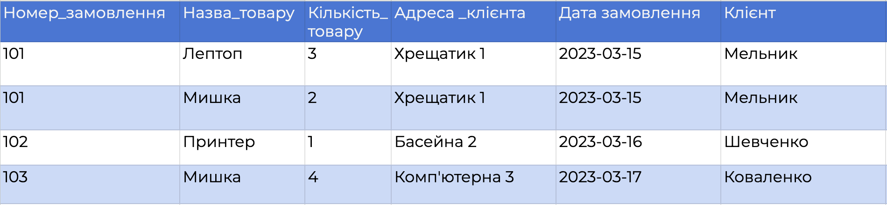
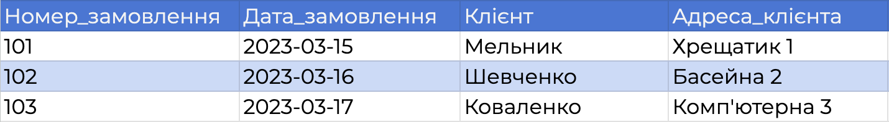
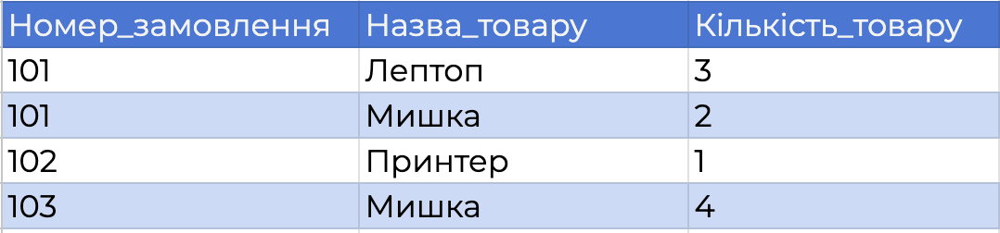
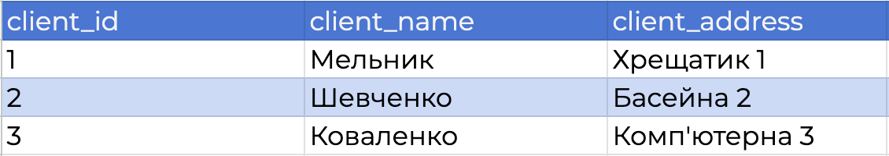
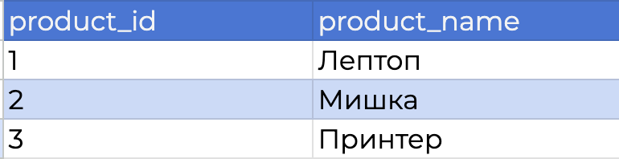
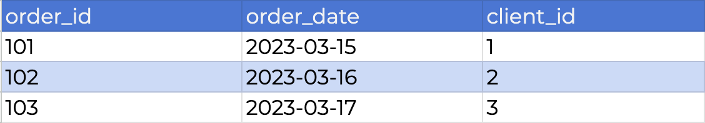
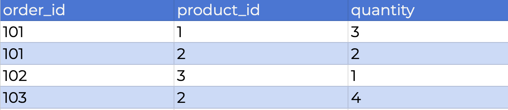
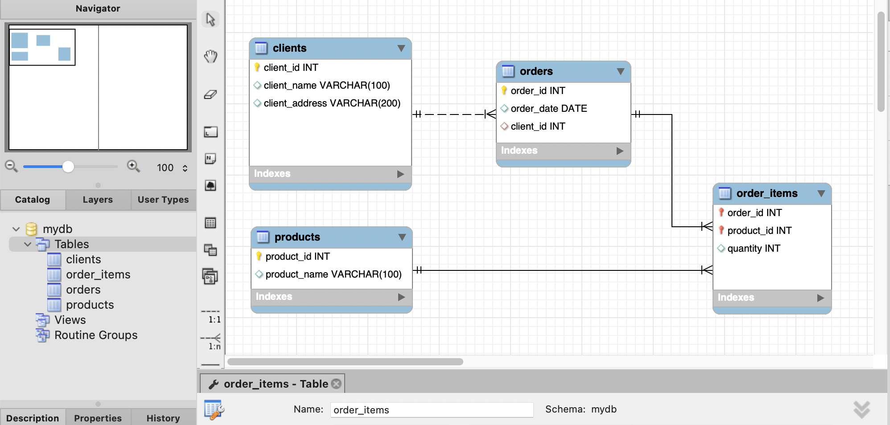
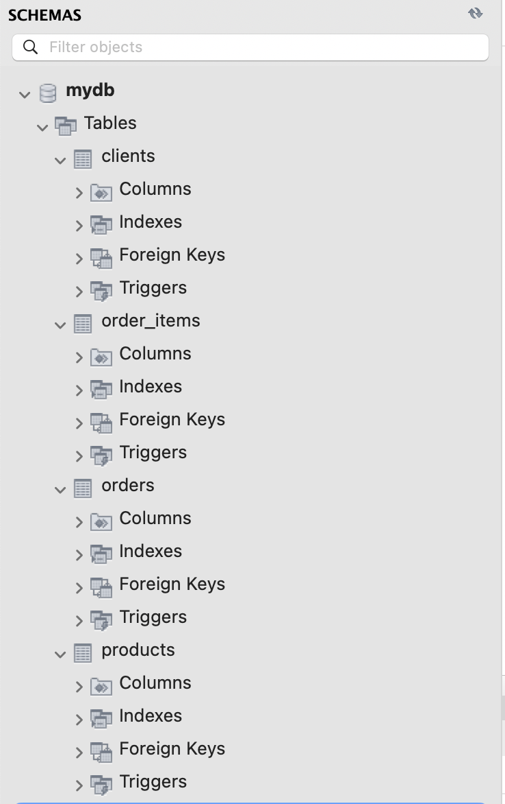

# Звіт до теми "Проектування баз даних з використанням семантичних моделей"

## Вступ

Мета цього завдання — привести початкову таблицю до вимог нормалізації (1НФ, 2НФ, 3НФ), побудувати ER-діаграму отриманої структури та створити відповідні таблиці в реляційній базі даних MySQL.

У роботі виконано:
1) аналіз початкової таблиці та виявлення проблем нормалізації;
2) поетапне перетворення до 1НФ, 2НФ і 3НФ з фіксацією отриманих таблиць;
3) побудову ER-діаграми на основі нормалізованих таблиць;
4) створення таблиць у MySQL (через MySQL Workbench) з визначенням первинних та зовнішніх ключів.

## Аналіз поточної таблиці

**Початкова таблиця**

<table border="1" cellpadding="8" cellspacing="0">
  <thead>
    <tr>
      <th>Номер_замовлення</th>
      <th>Назва_товару і кількість</th>
      <th>Адреса_клієнта</th>
      <th>Дата_замовлення</th>
      <th>Клієнт</th>
    </tr>
  </thead>
  <tbody>
    <tr>
      <td>101</td>
      <td>Лептоп: 3, Мишка: 2</td>
      <td>Хрещатик 1</td>
      <td>2023-03-15</td>
      <td>Мельник</td>
    </tr>
    <tr>
      <td>102</td>
      <td>Принтер: 1</td>
      <td>Басейна 2</td>
      <td>2023-03-16</td>
      <td>Шевченко</td>
    </tr>
    <tr>
      <td>103</td>
      <td>Мишка: 4</td>
      <td>Комп'ютерна 3</td>
      <td>2023-03-17</td>
      <td>Коваленко</td>
    </tr>
  </tbody>
</table>

Початкова таблиця містить інформацію про замовлення клієнтів і має таку структуру:

- Номер_замовлення  
- Назва_товару і кількість  
- Адреса_клієнта  
- Дата_замовлення  
- Клієнт  

Кожен рядок таблиці описує замовлення, проте дані в ній зберігаються у неструктурованому вигляді.

### Потенційний первинний ключ
Поле **Номер_замовлення** може бути використане як ідентифікатор замовлення, однак воно не забезпечує однозначної ідентифікації кожного товару в замовленні, оскільки одне замовлення може містити кілька товарів.

### Виявлені проблеми структури таблиці

1. Порушення першої нормальної форми (1НФ):  
   Поле **«Назва_товару і кількість»** містить кілька значень в одному полі (наприклад: `Лептоп: 3, Мишка: 2`), що порушує вимогу атомарності.

2. Надмірність даних:  
   Дані про клієнта (ПІБ та адреса) дублюються для кожного замовлення, що може призвести до аномалій оновлення.

3. Змішування різних сутностей в одній таблиці:  
   В одній таблиці зберігається інформація одразу про:
   - замовлення;
   - клієнтів;
   - товари та їх кількість.

4. Неможливість коректного масштабування:  
   Додавання нових товарів до замовлення або повторних замовлень клієнта ускладнює структуру таблиці та призводить до логічних помилок.

### Висновок аналізу
Початкова таблиця **не відповідає вимогам нормалізації** і потребує поетапного перетворення до першої, другої та третьої нормальних форм.

## Етапи виконання роботи

### Етап 1. Приведення таблиці до першої нормальної форми (1НФ)

Перша нормальна форма (1НФ) вимагає, щоб усі атрибути таблиці містили лише атомарні (неподільні) значення, а також щоб у таблиці не було повторюваних груп.

У початковій таблиці поле **«Назва_товару і кількість»** порушує вимогу атомарності, оскільки містить кілька значень в одному полі. Для приведення таблиці до 1НФ кожен товар у межах одного замовлення було винесено в окремий рядок.

У результаті приведення до 1НФ структура таблиці була змінена таким чином:
- поле **«Назва_товару і кількість»** розділено на окремі атрибути **«Назва_товару»** та **«Кількість»**;
- кожен рядок таблиці відповідає одному товару в конкретному замовленні.

Таблиця після приведення до 1НФ:

Після приведення до 1НФ усі значення в таблиці стали атомарними, однак у таблиці все ще присутня надмірність даних та залежності, які потребують подальшої нормалізації.

**Файл:** p1_1nf_table.png

### Етап 2. Приведення таблиць до другої нормальної форми (2НФ)

Друга нормальна форма (2НФ) вимагає, щоб таблиця перебувала у 1НФ та, щоб
усі неключові атрибути повністю залежали від усього первинного ключа.

Після приведення до 1НФ первинний ключ таблиці є складеним
(**Номер_замовлення**, **Назва_товару**).
Однак у таблиці присутні атрибути, які залежать лише від частини цього ключа:

- **Адреса_клієнта**, **Дата_замовлення**, **Клієнт** залежать тільки від **Номер_замовлення**;
- **Кількість_товару** залежить від поєднання **Номер_замовлення** та **Назва_товару**.

Це означає наявність часткових залежностей, що порушує вимоги 2НФ.

Для усунення цих залежностей таблицю було розділено на дві окремі таблиці:

**Таблиця замовлень**

**Таблиця позицій замовлення**

**Файли:**
- p2_orders_table.png
- p2_order_items_table.png

### Етап 3. Приведення таблиць до третьої нормальної форми (3НФ)

Третя нормальна форма (3НФ) вимагає, щоб база даних перебувала у другій нормальній формі (2НФ)
та, щоб усі неключові атрибути залежали виключно від первинного ключа і не залежали
від інших неключових атрибутів (відсутність транзитивних залежностей).

Після приведення таблиць до 2НФ було виявлено транзитивну залежність у структурі замовлень:
дані про клієнта та його адресу не залежать безпосередньо від ідентифікатора замовлення,
а визначаються сутністю клієнта.

Для усунення цієї залежності було виконано такі зміни:
- інформацію про клієнтів винесено в окрему таблицю **Клієнти** з первинним ключем **client_id**;
- у таблиці **Замовлення** замість даних про клієнта збережено зовнішній ключ **client_id**;
- інформацію про товари винесено в окрему таблицю **Товари** з первинним ключем **product_id**;
- у таблиці **Деталі замовлення** збережено зв’язок між замовленням і товаром через зовнішні ключі
  **order_id** та **product_id**.

У результаті приведення до 3НФ всі неключові атрибути залежать тільки від своїх первинних ключів,
а транзитивні залежності між даними усунено.

**Таблиця: Clients**

**Таблиця: Products**

**Таблиця: Orders**

**Таблиця: Order Details**

**Файли:** 
- p3_clients_table.png
- p3_products_table.png
- p3_orders_table.png
- p3_order_details_table.png

### Етап 4. Розробка ER-діаграми

На цьому етапі було розроблено ER-діаграму бази даних на основі таблиць,
отриманих після приведення структури до третьої нормальної форми (3НФ).

Метою побудови ER-діаграми є візуальне відображення сутностей,
їх атрибутів, первинних ключів та зв’язків між таблицями.

**Сутності, представлені на ER-діаграмі**

У результаті нормалізації було виділено такі сутності:

- **Clients** — зберігає інформацію про клієнтів;
- **Orders** — зберігає інформацію про замовлення клієнтів;
- **Products** — зберігає інформацію про товари;
- **Order_Items** — зберігає склад замовлень та реалізує зв’язок між замовленнями і товарами.

**Ключі та зв’язки між таблицями**

- Таблиця **Clients** має первинний ключ client_id.
- Таблиця **Orders** має первинний ключ order_id та зовнішній ключ client_id, який посилається на таблицю Clients.
- Таблиця **Products** має первинний ключ product_id.
- Таблиця **Order_Items** використовує складений первинний ключ (order_id, product_id) та містить зовнішні ключі:
  - order_id → orders.order_id
  - product_id → products.product_id

Таким чином:

- один клієнт може мати кілька замовлень (зв’язок **1:N** між Clients і Orders);
- одне замовлення може містити кілька товарів, а один товар може входити до кількох замовлень (зв’язок **M:N**, реалізований через таблицю Order_Items).

**ER-діаграма**

ER-діаграма, що відображає описану структуру таблиць та їх зв’язки:

**Файл:** p4_er_diagram.png

### Етап 5. Створення бази даних

На основі розробленої ER-діаграми було виконано пряме проєктування бази даних (Forward Engineering) у середовищі MySQL Workbench.

**У результаті створено схему бази даних:**

- mydb

**До складу схеми входять таблиці:**

- clients

- products
- orders
- order_items

**Реалізовані обмеження цілісності:**

- для кожної таблиці визначено первинні ключі (PRIMARY KEY);
- встановлено зовнішні ключі (FOREIGN KEY) відповідно до ER-діаграми;
- забезпечено зв’язки між таблицями:
  - clients ↔ orders (1:N),
  - orders ↔ order_items (1:N),
  - products ↔ order_items (1:N);
- для зовнішніх ключів використано правила:
  - ON UPDATE CASCADE,
  - ON DELETE RESTRICT.

База даних та всі таблиці успішно створені, що підтверджується відображенням структури схеми mydb у розділі SCHEMAS MySQL Workbench.

**Файли:** 
- p5_schema_creation.png
- p5_database_structure.png
- p5_database_details_1.png
- p5_database_details_2.png

## Висновки.

У ході роботи було спроєктовано структуру бази даних, визначено сутності та їх атрибути, а також налаштовано коректні зв’язки між таблицями. За допомогою MySQL Workbench виконано Forward Engineering, у результаті чого база даних успішно створена та готова до подальшого використання.